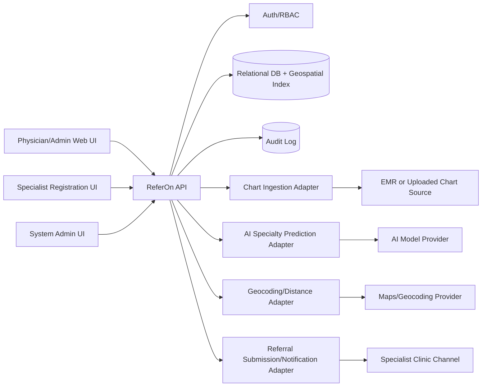
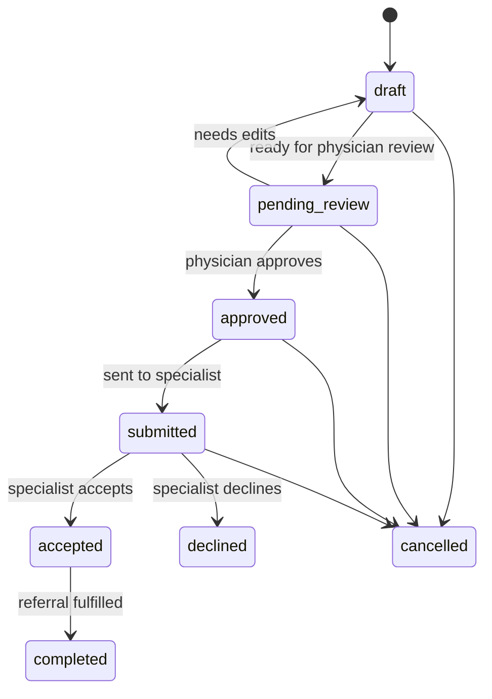
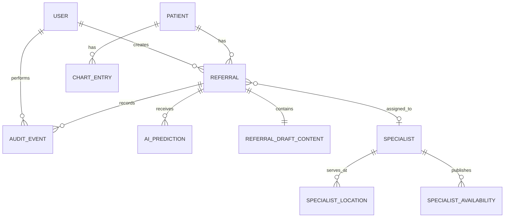

# ReferOn Master Document

Version: 0.1  
Status: Draft  
Last updated: 2026-06-18  
Owner: ReferOn product and engineering

## 1. Purpose

ReferOn is a dedicated web application for creating medical referrals from a patient's latest medical chart history. The application helps clinicians identify the likely specialty required, draft referral packages, and route those referrals to appropriate nearby specialists with availability.

The system is decision-support software. It does not diagnose, independently order care, or replace physician judgment. Every referral must be reviewed and submitted by an authorized clinician or delegated administrator according to clinic policy.

## 2. Product Goals

- Reduce administrative effort required to create complete specialist referrals.
- Use recent chart history to suggest the most relevant specialist type.
- Allow physicians and authorized admins to manually trigger referral creation.
- Maintain a searchable registry of self-registered specialists.
- Match referrals to available specialists using specialty, geography, eligibility, and availability.
- Preserve clinical accountability through review, approval, audit logs, and clear AI provenance.

## 3. Scope

### 3.1 In Scope

- Patient chart ingestion from a connected source or uploaded chart bundle.
- Referral draft generation using latest chart history.
- AI-assisted specialty prediction with confidence, rationale, and source references.
- Manual referral trigger for authorized users.
- Referral review, edit, approve, submit, and status tracking workflows.
- Specialist self-registration and profile management.
- Specialist location capture and nearest-neighbor search.
- Availability-aware specialist matching.
- Role-based access control.
- Audit logging for clinical and administrative actions.
- API-first backend suitable for future integrations.

### 3.2 Out of Scope for Initial MVP

- Direct diagnosis generation.
- Fully autonomous referral submission without human review.
- Billing, claims, or payment workflows.
- Patient-facing appointment booking.
- Cross-border regulatory handling beyond the initial deployment jurisdiction.
- Direct write-back to all EMRs. Initial integration may be read-only or mocked.

## 4. Users and Roles

| Role | Description | Core Capabilities |
| --- | --- | --- |
| Physician | Licensed clinician responsible for referrals | Trigger, review, edit, approve, submit referrals |
| Admin | Authorized clinical office staff | Trigger drafts, prepare referral packages, manage statuses |
| Specialist | External specialist or clinic representative | Self-register, manage specialty/location/availability profile |
| System Admin | Internal operator | Manage users, verify specialists, configure system |
| Auditor/Compliance | Compliance reviewer | Read audit trails and access reports |

## 5. Core Workflows

### 5.1 AI-Assisted Referral Creation

1. Physician or admin selects a patient.
2. User triggers "Create referral from latest chart."
3. System retrieves the patient's latest relevant chart history.
4. AI service predicts the required specialty and produces:
   - predicted specialty,
   - confidence score,
   - rationale,
   - source chart references,
   - missing information warnings.
5. System drafts a referral package.
6. User reviews and edits the draft.
7. User selects a specialist from ranked matches.
8. Physician approves and submits the referral.
9. System records the audit trail and referral status.

### 5.2 Manual Referral Trigger

1. Authorized user starts a referral manually.
2. User selects patient, reason for referral, preferred specialty, urgency, and notes.
3. System may optionally enrich the draft from chart history.
4. Matching and approval proceed through the standard referral workflow.

### 5.3 Specialist Self-Registration

1. Specialist opens registration page.
2. Specialist submits identity, license, clinic, specialty, location, contact, referral criteria, and availability.
3. System creates an unverified specialist profile.
4. System admin verifies credentials and approves the profile.
5. Approved specialist becomes eligible for matching.

### 5.4 Specialist Matching

1. System receives referral specialty, patient location, urgency, constraints, and optional preferences.
2. System filters specialists by:
   - verified status,
   - specialty and subspecialty,
   - referral eligibility criteria,
   - accepting-new-referrals flag,
   - availability window,
   - insurance or payer constraints where applicable.
3. System ranks candidates by:
   - distance from patient,
   - next available appointment or intake capacity,
   - specialty fit,
   - historical acceptance rate,
   - referring physician preference where configured.

## 6. Functional Requirements

### 6.1 Patient and Chart History

- FR-001: The system shall store patient identity and demographic metadata required to create a referral.
- FR-002: The system shall ingest chart history from an EMR connector, document upload, or seeded development fixture.
- FR-003: The system shall identify the latest clinically relevant chart entries for referral generation.
- FR-004: The system shall preserve references from generated referral content back to source chart entries.
- FR-005: The system shall show warnings when chart data is stale, incomplete, or unavailable.

### 6.2 Referral Drafting

- FR-010: The system shall create a referral draft from patient chart history.
- FR-011: The system shall allow authorized users to create a referral manually.
- FR-012: The system shall support referral fields including reason, specialty, urgency, history, medications, allergies, investigations, attachments, and notes.
- FR-013: The system shall allow physicians and admins to edit drafts before submission.
- FR-014: The system shall require physician approval before final submission unless clinic policy explicitly permits delegated submission.
- FR-015: The system shall maintain referral status values: draft, pending_review, approved, submitted, accepted, declined, completed, cancelled.

### 6.3 AI Specialty Prediction

- FR-020: The system shall predict the most likely required specialty from chart history.
- FR-021: The system shall return confidence and rationale with each AI prediction.
- FR-022: The system shall expose chart references used by AI-generated suggestions.
- FR-023: The system shall allow users to override AI-predicted specialty.
- FR-024: The system shall log AI model version, prompt/template version, input references, output, and user overrides.
- FR-025: The system shall avoid presenting AI output as diagnosis or final clinical decision.

### 6.4 Specialist Registry

- FR-030: The system shall allow specialists to self-register.
- FR-031: The system shall require specialist profile verification before matching.
- FR-032: The system shall capture specialty, subspecialty, license number, clinic name, service locations, contact methods, accepted referral types, and availability.
- FR-033: The system shall allow specialists to update availability and accepting-referrals status.
- FR-034: The system shall allow system admins to approve, reject, suspend, and reactivate specialist profiles.

### 6.5 Geographic Matching

- FR-040: The system shall store specialist service locations as latitude/longitude coordinates.
- FR-041: The system shall geocode patient and specialist addresses when address data is available.
- FR-042: The system shall support nearest-neighbor search by distance from patient location.
- FR-043: The system shall rank available specialists using distance and availability.
- FR-044: The system shall show distance and next availability in referral matching results.

### 6.6 Security, Access, and Audit

- FR-050: The system shall authenticate all internal users.
- FR-051: The system shall enforce role-based access control.
- FR-052: The system shall log patient chart access, referral generation, edits, approvals, submissions, and specialist profile changes.
- FR-053: The system shall allow compliance users to export audit records for a patient or referral.
- FR-054: The system shall apply least-privilege access to protected health information.

## 7. Non-Functional Requirements

### 7.1 Privacy and Compliance

- NFR-001: The system shall protect health information in transit using TLS.
- NFR-002: The system shall encrypt sensitive data at rest.
- NFR-003: The system shall keep immutable audit logs for clinical access and referral actions.
- NFR-004: The system shall support configurable data retention policies.
- NFR-005: The system shall separate development, staging, and production data.
- NFR-006: The system shall never use production patient data in non-production environments unless explicitly de-identified and approved.

### 7.2 Reliability

- NFR-010: Referral creation shall fail safely when chart retrieval or AI prediction is unavailable.
- NFR-011: Users shall be able to create manual referrals without AI service availability.
- NFR-012: The system shall preserve draft state during partial failures.
- NFR-013: The system shall expose operational health checks.

### 7.3 Performance

- NFR-020: Patient search should return results within 500 ms for common queries under normal load.
- NFR-021: Specialist matching should return ranked results within 1 second for MVP data volumes.
- NFR-022: AI-assisted draft generation should complete within 30 seconds or present progress and retry affordances.

### 7.4 Observability

- NFR-030: The system shall emit structured logs for API requests, referral workflow events, and AI service calls.
- NFR-031: The system shall track metrics for referral generation latency, AI prediction confidence distribution, matching latency, and submission failures.
- NFR-032: The system shall support trace IDs across frontend, backend, AI, and integration calls.

### 7.5 Maintainability

- NFR-040: The system shall keep API contracts versioned.
- NFR-041: The system shall use automated tests for core workflow behavior.
- NFR-042: Architecture decisions shall be documented as ADRs when material tradeoffs are made.

## 8. System Architecture

### 8.1 Proposed MVP Components

- Web frontend: Clinician, admin, specialist, and system admin user interfaces.
- API backend: Authenticated REST or JSON API for referral, patient, specialist, and matching workflows.
- Relational database: Core transactional data with geospatial indexing support.
- AI service adapter: Boundary around model calls, prompt templates, safety checks, and provenance logging.
- Chart ingestion adapter: EMR connector, upload parser, or development fixture provider.
- Geocoding adapter: Converts addresses to coordinates.
- Notification adapter: Email/fax/API submission placeholders depending on jurisdiction and clinic integration.

### 8.2 Architecture Diagram



### 8.3 Referral State Diagram



## 9. Data Model Draft

### 9.1 Core Entities

| Entity | Purpose |
| --- | --- |
| User | Authenticated internal user |
| Patient | Patient demographics and location metadata |
| ChartEntry | Imported or uploaded chart history unit |
| Referral | Main referral record and workflow state |
| ReferralDraftContent | Generated and edited referral content |
| AIPrediction | Specialty prediction, confidence, rationale, model metadata |
| Specialist | Verified or pending specialist profile |
| SpecialistLocation | Geocoded clinic/service location |
| SpecialistAvailability | Intake capacity and availability windows |
| AuditEvent | Immutable record of sensitive actions |

### 9.2 Entity Relationship Sketch



## 10. API Definitions

The first implementation should treat these as draft contracts. Exact request/response schemas should be promoted into an OpenAPI spec once the backend framework is selected.

### 10.1 Authentication and Users

| Method | Path | Description |
| --- | --- | --- |
| POST | `/api/v1/auth/login` | Start authenticated session |
| POST | `/api/v1/auth/logout` | End session |
| GET | `/api/v1/me` | Return current user and roles |

### 10.2 Patients and Charts

| Method | Path | Description |
| --- | --- | --- |
| GET | `/api/v1/patients` | Search patients |
| GET | `/api/v1/patients/{patientId}` | Get patient summary |
| GET | `/api/v1/patients/{patientId}/chart-entries` | Get chart history |
| POST | `/api/v1/patients/{patientId}/chart-ingestions` | Ingest chart data |

### 10.3 Referrals

| Method | Path | Description |
| --- | --- | --- |
| GET | `/api/v1/referrals` | List referrals |
| POST | `/api/v1/referrals` | Create manual referral draft |
| POST | `/api/v1/referrals/from-chart` | Create AI-assisted referral draft |
| GET | `/api/v1/referrals/{referralId}` | Get referral details |
| PATCH | `/api/v1/referrals/{referralId}` | Update referral draft |
| POST | `/api/v1/referrals/{referralId}/predict-specialty` | Re-run specialty prediction |
| POST | `/api/v1/referrals/{referralId}/submit-for-review` | Move draft to review |
| POST | `/api/v1/referrals/{referralId}/approve` | Physician approval |
| POST | `/api/v1/referrals/{referralId}/submit` | Submit to selected specialist |
| POST | `/api/v1/referrals/{referralId}/cancel` | Cancel referral |

### 10.4 Specialist Registry and Matching

| Method | Path | Description |
| --- | --- | --- |
| POST | `/api/v1/specialists/register` | Specialist self-registration |
| GET | `/api/v1/specialists` | Search specialists |
| GET | `/api/v1/specialists/{specialistId}` | Get specialist profile |
| PATCH | `/api/v1/specialists/{specialistId}` | Update specialist profile |
| POST | `/api/v1/specialists/{specialistId}/verify` | Admin verifies profile |
| POST | `/api/v1/specialists/{specialistId}/suspend` | Admin suspends profile |
| GET | `/api/v1/referrals/{referralId}/specialist-matches` | Get ranked specialist matches |

### 10.5 Example: AI-Assisted Referral Request

```json
{
  "patientId": "pat_123",
  "triggeredByUserId": "usr_456",
  "chartWindowDays": 180,
  "urgency": "routine",
  "additionalInstructions": "Consider recent knee imaging and persistent pain notes."
}
```

### 10.6 Example: AI-Assisted Referral Response

```json
{
  "referralId": "ref_789",
  "status": "draft",
  "predictedSpecialty": {
    "specialty": "Orthopedic Surgery",
    "confidence": 0.82,
    "rationale": "Recent chart entries mention persistent knee pain, failed conservative management, and abnormal imaging.",
    "sourceChartEntryIds": ["chart_001", "chart_002"]
  },
  "warnings": [
    "Medication list has not been updated in over 90 days."
  ]
}
```

## 11. AI Design Notes

### 11.1 AI Responsibilities

- Classify likely specialty or subspecialty.
- Draft referral summary sections from cited chart entries.
- Identify missing information that may block referral acceptance.
- Suggest urgency only as decision support with explicit review requirement.

### 11.2 Guardrails

- Require source references for clinical claims.
- Refuse unsupported clinical assertions.
- Keep generated text editable and visibly marked as AI-assisted until reviewed.
- Log user changes after AI output.
- Include confidence thresholds for review emphasis:
  - high: 0.80 and above,
  - medium: 0.50 to 0.79,
  - low: below 0.50 requiring manual specialty selection.

### 11.3 Evaluation

- Build a de-identified test set of historical referral scenarios.
- Track top-1 and top-3 specialty accuracy.
- Track unsafe or unsupported generated statements.
- Review model performance by specialty class to detect blind spots.

## 12. Security and Privacy Model

- Authentication should use an established identity provider where practical.
- Authorization should be role-based with patient-context checks.
- Audit logs must be append-only from the application perspective.
- PHI must be redacted from general application logs.
- Secrets must be stored in managed secret storage, not source control.
- AI provider integration must be configured so patient data is not retained for provider training unless explicitly permitted by contract and policy.
- Production access should require MFA for internal users.

## 13. Test Methodology

### 13.1 Test Pyramid

- Unit tests for matching logic, referral state transitions, permission checks, and AI adapter parsing.
- Integration tests for API endpoints, database persistence, geospatial search, and chart ingestion.
- Contract tests for AI adapter response schema and EMR/geocoding adapters.
- End-to-end tests for referral creation, review, specialist registration, verification, and matching.
- Security tests for authorization boundaries and PHI leakage in logs.

### 13.2 Clinical Safety Testing

- Golden-case referral scenarios with expected specialty outputs.
- Adversarial chart entries with ambiguous or conflicting symptoms.
- Missing-data scenarios where the system must warn instead of overconfidently generating.
- Human review checklist for AI-generated referral drafts.

### 13.3 Acceptance Criteria for MVP

- A physician can create a referral draft from patient chart history.
- An admin can manually create a referral draft for physician review.
- AI prediction returns specialty, confidence, rationale, and source references.
- A specialist can self-register and remain unavailable for matching until verified.
- Verified specialists can be ranked by specialty fit, distance, and availability.
- All sensitive actions are visible in audit history.
- Manual workflow remains usable when AI service is unavailable.

## 14. Initial Implementation Plan

### Phase 0: Foundations

- Choose application stack.
- Add OpenAPI contract.
- Establish database schema and migrations.
- Implement authentication/RBAC skeleton.
- Create seed data for patients, chart entries, and specialists.

### Phase 1: Referral Drafting

- Build patient search and chart summary.
- Build manual referral creation.
- Build referral state machine.
- Build physician review and approval flow.

### Phase 2: AI Assistance

- Implement AI adapter boundary.
- Add specialty prediction endpoint.
- Add AI provenance records.
- Add chart reference display.
- Add manual override flow.

### Phase 3: Specialist Registry and Matching

- Build specialist self-registration.
- Build admin verification.
- Add geocoded specialist locations.
- Implement nearest-neighbor matching.
- Add availability-aware ranking.

### Phase 4: Hardening

- Add audit export.
- Add observability.
- Add security tests.
- Add clinical evaluation set.
- Prepare deployment pipeline.

## 15. Open Questions

- What jurisdiction and privacy framework should be assumed first?
- Which EMR or chart source should the MVP target?
- Should referrals be submitted by fax, secure email, direct API, or manual export in the first version?
- What specialist taxonomy should be canonical?
- Who verifies specialist identity and licensing?
- Is patient consent required at referral creation, submission, or both?
- What distance metric should be used initially: straight-line distance, driving distance, or travel time?
- Should availability be self-reported, integrated from calendars, or manually managed?

## 16. Decision Log

| Date | Decision | Rationale |
| --- | --- | --- |
| 2026-06-18 | Use document-driven development with this master document as the initial source of truth. | Align product, architecture, APIs, and tests before implementation starts. |
| 2026-06-18 | Treat AI as clinician-facing decision support, not autonomous clinical decision-making. | Preserve clinical accountability and reduce safety risk. |
| 2026-06-18 | Require specialist verification before matching. | Avoid routing referrals to untrusted or incomplete profiles. |

## 17. Document Maintenance Rules

- Update this document when requirements, API contracts, architecture, data model, or test methodology materially change.
- Add ADRs for decisions that are too detailed or contentious for the decision log.
- Keep diagrams current with implemented architecture.
- Link implementation tickets or pull requests back to relevant sections when possible.
- Prefer small, reviewed updates over large stale rewrites.
